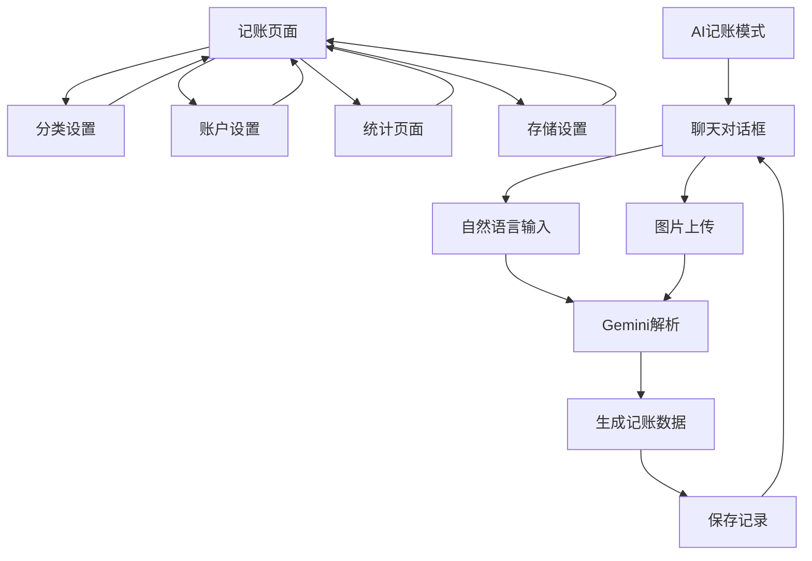

## 1. 产品概述
个人记账Web应用，帮助用户管理个人财务收支。通过分类管理、账户设置、智能记账和统计分析，让用户轻松掌握财务状况。

目标用户：需要管理个人财务的普通用户，支持日常记账、分类统计和数据同步备份。

## 2. 核心功能

### 2.1 用户角色
本应用为单用户设计，无需注册登录，数据本地存储。

### 2.2 功能模块
个人记账应用包含以下主要页面：
1. **记账页面**：收支记录录入、今日记录展示、本周统计图表
2. **分类设置页面**：消费和收入的一二级分类管理
3. **账户设置页面**：多货币账户信息管理
4. **统计页面**：收支数据可视化统计
5. **存储设置页面**：本地存储和云端同步配置

### 2.3 页面详情

| 页面名称 | 模块名称 | 功能描述 |
|---------|---------|---------|
| 记账页面 | 记账表单 | 录入收支记录（时间、类型、分类、金额、项目、记账人、账户、备注），支持修改删除 |
| 记账页面 | 账户选择 | 下拉框显示账户名称-余额，输入金额后显示记账后余额 |
| 记账页面 | 分类联动 | 选择一级分类后，二级分类下拉框自动刷新 |
| 记账页面 | 今日记录 | 显示当天所有记账记录，汇总当日收支 |
| 记账页面 | 本周图表 | 显示本周收入支出柱状图 |
| 记账页面 | AI记账模式 | 聊天对话框，支持自然语言和小票图片识别，调用Gemini模型解析 |
| 分类设置页面 | 消费分类管理 | 维护消费一二级分类的增删改查 |
| 分类设置页面 | 收入分类管理 | 维护收入一二级分类的增删改查 |
| 账户设置页面 | 账户信息管理 | 维护各类账户（银行、证券、微信、支付宝、现金等）的增删改查 |
| 账户设置页面 | 货币设置 | 设置主货币（人民币）和各账户货币类型 |
| 统计页面 | 时间筛选 | 按天、周、月、年选择统计时间范围 |
| 统计页面 | 图表展示 | 折线图显示总资产、账户、消费/收入、一二级分类数据 |
| 存储设置页面 | 本地存储 | 所有数据保存到localStorage |
| 存储设置页面 | R2同步设置 | 配置Cloudflare R2连接信息和token |
| 存储设置页面 | 数据同步 | 上传下载数据zip压缩包，自动判断数据新旧 |

## 3. 核心流程

### 用户操作流程
1. **首次使用**：进入记账页面 → 设置分类和账户 → 开始记账
2. **日常记账**：打开应用 → 录入收支记录 → 查看今日汇总
3. **数据管理**：设置页面配置R2同步 → 定期备份数据
4. **财务分析**：统计页面选择时间范围 → 查看收支趋势图表

### AI记账流程
1. 开启AI记账模式 → 输入自然语言或上传小票图片
2. Gemini模型解析内容 → 自动生成记账表单数据
3. 用户确认后保存 → 在聊天框显示解析结果

## 4. 用户界面设计

### 4.1 设计风格
- **主色调**：绿色系（代表财富增长）
- **辅助色**：灰色系（用于背景和边框）
- **按钮样式**：圆角矩形，绿色主按钮，灰色次要按钮
- **字体**：系统默认字体，主要文字14-16px，标题18-20px
- **布局**：卡片式布局，底部导航栏固定
- **图标**：使用简洁的线性图标，如钱包、图表、设置等

### 4.2 页面设计概览

| 页面名称 | 模块名称 | UI元素 |
|---------|---------|---------|
| 记账页面 | 记账表单 | 白色卡片背景，绿色提交按钮，输入框带灰色边框，分类下拉框级联显示 |
| 记账页面 | 今日记录 | 时间轴样式展示记录，收入绿色文字，支出红色文字，底部显示汇总数据 |
| 记账页面 | 本周图表 | 柱状图使用绿色和红色区分收入支出，X轴显示日期，Y轴显示金额 |
| 分类设置页面 | 分类列表 | 树形结构展示一二级分类，一级分类可展开折叠，右侧编辑删除按钮 |
| 账户设置页面 | 账户卡片 | 每个账户显示为独立卡片，显示名称、货币、余额，支持左右滑动 |
| 统计页面 | 图表区域 | 折线图占据主要区域，顶部时间选择器，底部图例说明 |
| 存储设置页面 | 同步状态 | 显示上次同步时间，R2连接状态指示灯，压缩进度条 |

### 4.3 响应式设计
- **桌面端**：最大宽度1200px居中显示，左右分栏布局
- **移动端**：单栏布局，底部导航栏适配触摸操作
- **断点**：768px为界，小于768px使用移动端布局
- **触摸优化**：按钮最小44px，增加触摸反馈效果

### 4.4 AI记账界面
- **聊天对话框**：占据页面主要区域，类似微信聊天界面
- **输入区域**：底部输入框支持文字和图片，发送按钮在右侧
- **消息气泡**：用户消息右对齐绿色背景，AI回复左对齐白色背景
- **解析结果**：以卡片形式展示提取的记账信息，包含确认和编辑按钮