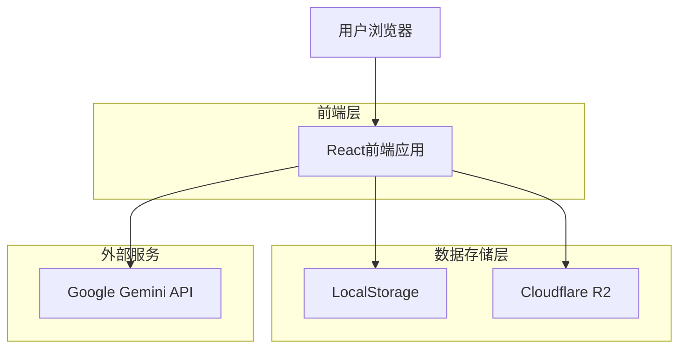
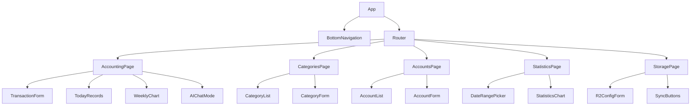

## 1. 架构设计



## 2. 技术描述

- **前端**：React@18 + TypeScript + Tailwind CSS + Vite
- **初始化工具**：vite-init
- **状态管理**：React Context + useReducer
- **图表库**：Chart.js + react-chartjs-2
- **压缩库**：JSZip
- **AI服务**：Google Gemini API
- **后端**：无（纯前端应用）

## 3. 路由定义

| 路由 | 用途 |
|------|------|
| / | 记账页面（默认首页） |
| /categories | 分类设置页面 |
| /accounts | 账户设置页面 |
| /statistics | 统计页面 |
| /storage | 存储设置页面 |

## 4. 数据模型定义

### 4.1 核心数据类型

```typescript
// 分类模型
interface Category {
  id: string;
  name: string;
  type: 'income' | 'expense';
  parentId?: string; // 一级分类为空，二级分类为父级ID
  icon?: string;
  sortOrder: number;
}

// 账户模型
interface Account {
  id: string;
  name: string;
  type: 'bank' | 'securities' | 'wechat' | 'alipay' | 'cash' | 'other';
  currency: string;
  balance: number;
  isMain: boolean; // 主账户（人民币）
  exchangeRate?: number; // 对人民币汇率
  color?: string;
}

// 记账记录模型
interface Transaction {
  id: string;
  date: string; // ISO日期格式
  type: 'income' | 'expense';
  categoryId: string;
  subcategoryId?: string;
  amount: number;
  project?: string;
  accountId: string;
  payer?: string;
  note?: string;
  attachments?: string[]; // 图片附件路径
  createdAt: string;
  updatedAt: string;
}

// 汇率模型
interface ExchangeRate {
  currency: string;
  rate: number; // 对人民币汇率
  updatedAt: string;
}

// 应用设置
interface AppSettings {
  aiAccounting: boolean;
  geminiToken?: string;
  mainCurrency: string; // 主货币，默认为CNY
  lastSyncTime?: string;
  r2Config?: {
    endpoint: string;
    accessKeyId: string;
    secretAccessKey: string;
    bucket: string;
  };
}
```

### 4.2 本地存储结构

```typescript
interface LocalStorageData {
  categories: Category[];
  accounts: Account[];
  transactions: Transaction[];
  exchangeRates: ExchangeRate[];
  settings: AppSettings;
  lastUpdated: string;
}
```

### 4.3 压缩数据结构

```typescript
interface CompressedDataPackage {
  version: string;
  timestamp: string;
  data: LocalStorageData;
  checksum: string; // 数据校验和
}
```

## 5. 组件架构

### 5.1 页面组件结构



### 5.2 核心工具函数

```typescript
// 货币转换工具
class CurrencyConverter {
  static convert(amount: number, fromCurrency: string, toCurrency: string, rates: ExchangeRate[]): number;
  static getMainCurrencyAmount(amount: number, currency: string, rates: ExchangeRate[]): number;
}

// 数据压缩工具
class DataCompressor {
  static compress(data: LocalStorageData): Promise<Blob>;
  static decompress(blob: Blob): Promise<LocalStorageData>;
}

// R2同步工具
class R2SyncManager {
  static upload(data: LocalStorageData, config: R2Config): Promise<void>;
  static download(config: R2Config): Promise<LocalStorageData>;
  static getLatestTimestamp(config: R2Config): Promise<string>;
}

// AI记账解析器
class AIAccountingParser {
  static parseText(text: string, token: string): Promise<Partial<Transaction>>;
  static parseImage(imageBase64: string, token: string): Promise<Partial<Transaction>>;
}
```

## 6. 状态管理设计

### 6.1 Context结构

```typescript
interface AppContextType {
  // 数据状态
  categories: Category[];
  accounts: Account[];
  transactions: Transaction[];
  exchangeRates: ExchangeRate[];
  settings: AppSettings;
  
  // 操作方法
  addCategory: (category: Omit<Category, 'id'>) => void;
  updateCategory: (id: string, category: Partial<Category>) => void;
  deleteCategory: (id: string) => void;
  
  addAccount: (account: Omit<Account, 'id'>) => void;
  updateAccount: (id: string, account: Partial<Account>) => void;
  deleteAccount: (id: string) => void;
  updateAccountBalance: (id: string, amount: number) => void;
  
  addTransaction: (transaction: Omit<Transaction, 'id'>) => void;
  updateTransaction: (id: string, transaction: Partial<Transaction>) => void;
  deleteTransaction: (id: string) => void;
  
  updateSettings: (settings: Partial<AppSettings>) => void;
  
  // 工具方法
  getCategoriesByType: (type: 'income' | 'expense') => Category[];
  getSubcategories: (parentId: string) => Category[];
  getAccountBalance: (accountId: string) => number;
  getTransactionsByDateRange: (startDate: string, endDate: string) => Transaction[];
}
```

### 6.2 数据持久化

```typescript
// 自定义hook用于数据持久化
function usePersistentState<T>(key: string, defaultValue: T): [T, (value: T) => void] {
  const [state, setState] = useState<T>(() => {
    const stored = localStorage.getItem(key);
    return stored ? JSON.parse(stored) : defaultValue;
  });
  
  const setPersistentState = (value: T) => {
    setState(value);
    localStorage.setItem(key, JSON.stringify(value));
  };
  
  return [state, setPersistentState];
}
```

## 7. 响应式设计实现

### 7.1 断点设置

```css
/* Tailwind CSS配置 */
module.exports = {
  theme: {
    screens: {
      'mobile': {'max': '767px'},
      'desktop': {'min': '768px'},
    }
  }
}
```

### 7.2 移动端适配

```typescript
// 检测移动端hook
function useIsMobile(): boolean {
  const [isMobile, setIsMobile] = useState(false);
  
  useEffect(() => {
    const checkMobile = () => {
      setIsMobile(window.innerWidth < 768);
    };
    
    checkMobile();
    window.addEventListener('resize', checkMobile);
    return () => window.removeEventListener('resize', checkMobile);
  }, []);
  
  return isMobile;
}
```

## 8. 错误处理

### 8.1 错误类型定义

```typescript
enum ErrorType {
  STORAGE_ERROR = 'STORAGE_ERROR',
  NETWORK_ERROR = 'NETWORK_ERROR',
  VALIDATION_ERROR = 'VALIDATION_ERROR',
  SYNC_ERROR = 'SYNC_ERROR',
  AI_PARSE_ERROR = 'AI_PARSE_ERROR'
}

interface AppError {
  type: ErrorType;
  message: string;
  details?: any;
  timestamp: string;
}
```

### 8.2 错误边界

```typescript
class ErrorBoundary extends React.Component<Props, State> {
  static getDerivedStateFromError(error: Error): State {
    return { hasError: true, error };
  }
  
  componentDidCatch(error: Error, errorInfo: ErrorInfo) {
    console.error('App Error:', error, errorInfo);
    // 记录错误日志
  }
}
```